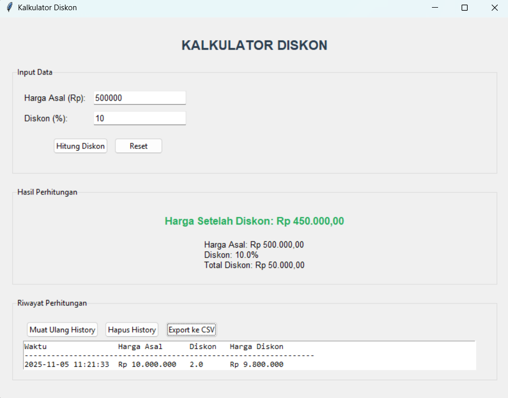
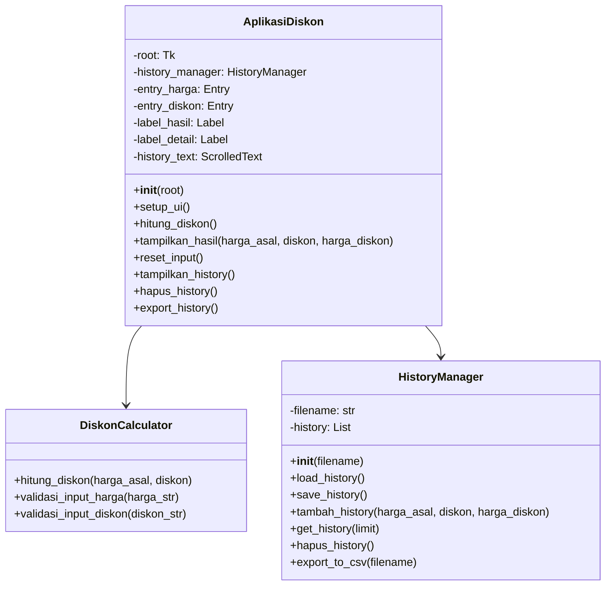
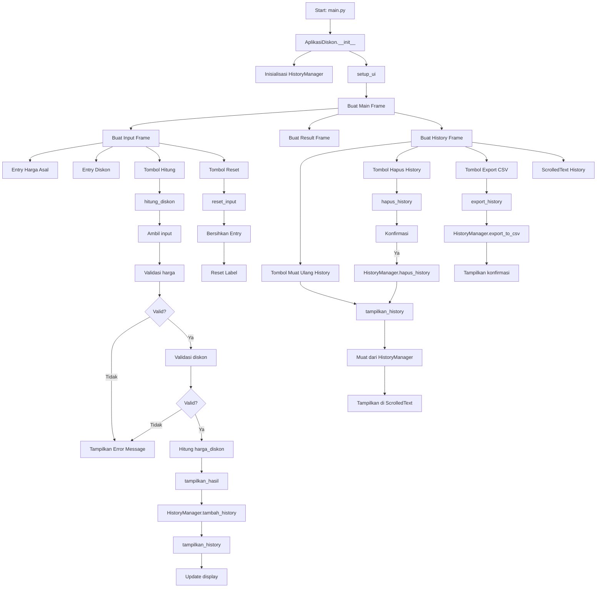
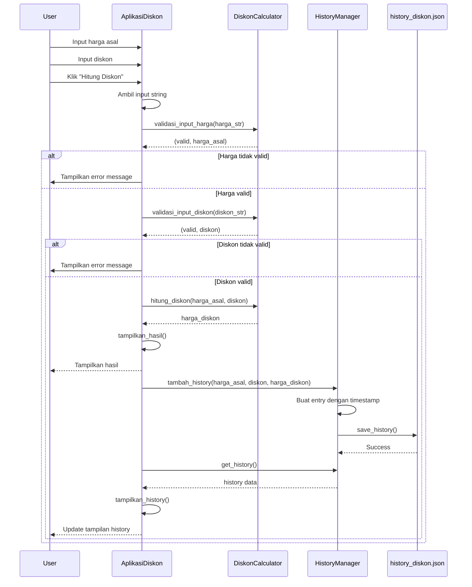

# 🏷️ Kalkulator Diskon

<div align="center">


**Aplikasi kalkulator diskon sederhana dengan fitur riwayat perhitungan dan export data**

</div>

## 📋 Deskripsi Proyek

**Kalkulator Diskon** adalah aplikasi desktop berbasis Python yang dirancang untuk membantu pengguna menghitung harga setelah diskon dengan cepat dan akurat. Aplikasi ini sangat berguna bagi pelanggan yang ingin mengetahui harga akhir setelah diskon, maupun bagi penjual yang perlu memberikan informasi potongan harga kepada pelanggan.

Dengan antarmuka yang sederhana dan mudah digunakan, pengguna cukup memasukkan harga asal dan persentase diskon, lalu aplikasi akan langsung menampilkan harga setelah diskon, beserta detail perhitungan seperti total potongan harga. Aplikasi juga dilengkapi dengan fitur riwayat perhitungan yang menyimpan semua perhitungan sebelumnya, sehingga pengguna dapat melihat kembali perhitungan yang telah dilakukan.

Fitur utama aplikasi ini:
- **Perhitungan Diskon Otomatis**: Menghitung harga setelah diskon dengan validasi input
- **Riwayat Perhitungan**: Menyimpan semua perhitungan ke file JSON
- **Export ke CSV**: Mengekspor riwayat perhitungan ke format CSV
- **Antarmuka Sederhana**: Mudah digunakan dengan shortcut keyboard (Enter)

## 📑 Daftar Isi

- [Deskripsi Proyek](#-deskripsi-proyek)
- [Demo](#-demo)
- [Tampilan Aplikasi](#-tampilan-aplikasi)
- [Latar Belakang](#-latar-belakang)
- [Fitur Utama](#-fitur-utama)
- [Teknologi yang Digunakan](#-teknologi-yang-digunakan)
- [Arsitektur](#-arsitektur)
- [Cara Instalasi](#-cara-instalasi)
- [Cara Penggunaan](#-cara-penggunaan)
- [Peran Developer](#-peran-developer)
- [Pembelajaran dari Proyek](#-pembelajaran-dari-proyek-lessons-learned)
- [Ucapan Terima Kasih](#-ucapan-terima-kasih)

## 🎮 Demo

(Coming Soon)

## 📸 Tampilan Aplikasi

### Tampilan Utama




## 🎯 Latar Belakang

Proyek ini dibuat sebagai proyek pribadi untuk mengembangkan keterampilan dalam:

- **Pengembangan Aplikasi Desktop dengan Tkinter**: Mempelajari cara membuat antarmuka yang sederhana namun fungsional
- **Validasi Input**: Mengimplementasikan validasi untuk memastikan data yang dimasukkan valid
- **Manajemen Data dengan JSON**: Menyimpan dan memuat riwayat perhitungan
- **Export Data ke CSV**: Mengekspor data ke format yang dapat dibuka di spreadsheet
- **Error Handling**: Menangani berbagai kemungkinan kesalahan input

Kebutuhan yang melatarbelakangi proyek ini:
- **Kebutuhan alat perhitungan diskon** yang cepat dan akurat
- **Kebutuhan pencatatan** perhitungan diskon untuk referensi
- **Pembuatan portofolio** yang menunjukkan kemampuan Python dasar dan Tkinter

## 🌟 Fitur Utama

### 🧮 **Kalkulator Diskon**

| Fitur | Deskripsi | Implementasi |
|-------|-----------|--------------|
| **Input Harga Asal** | Memasukkan harga awal produk | `Entry` widget dengan validasi |
| **Input Persentase Diskon** | Memasukkan persentase potongan harga | `Entry` widget dengan validasi |
| **Perhitungan Otomatis** | Menghitung harga setelah diskon | `hitung_diskon()` method |
| **Detail Perhitungan** | Menampilkan total potongan harga | Menampilkan selisih harga |
| **Format Mata Uang** | Menampilkan angka dalam format Rupiah | Format dengan separator ribuan |

### 📝 **Validasi Input**

| Fitur | Deskripsi | Aturan |
|-------|-----------|--------|
| **Harga Tidak Kosong** | Memastikan harga diisi | `if not harga_str` |
| **Harga Berupa Angka** | Validasi tipe data numerik | `float()` dengan try-except |
| **Harga Positif** | Harga harus > 0 | `if harga <= 0` |
| **Diskon Tidak Kosong** | Memastikan diskon diisi | `if not diskon_str` |
| **Diskon Berupa Angka** | Validasi tipe data numerik | `float()` dengan try-except |
| **Diskon Tidak Negatif** | Diskon tidak boleh negatif | `if diskon < 0` |
| **Diskon Maksimal 100%** | Diskon tidak boleh > 100% | `if diskon > 100` |

### 💾 **Manajemen Riwayat**

| Fitur | Deskripsi | Implementasi |
|-------|-----------|--------------|
| **Simpan Perhitungan** | Menyimpan setiap perhitungan | `tambah_history()` |
| **Tampilkan History** | Menampilkan 10 perhitungan terakhir | `tampilkan_history()` |
| **Muat Ulang History** | Memuat ulang dari file JSON | `load_history()` |
| **Hapus History** | Menghapus semua riwayat | `hapus_history()` |
| **Export CSV** | Mengekspor ke file CSV | `export_to_csv()` |

### 📄 **Export ke CSV**

| Fitur | Deskripsi | Format |
|-------|-----------|--------|
| **Header Tabel** | Kolom data yang diekspor | Waktu, Harga Asal, Diskon, Harga Diskon |
| **Format Standar** | Dapat dibuka di Excel/LibreOffice | CSV dengan delimiter koma |
| **Nama File** | Nama file default | `history_diskon.csv` |

### ⌨️ **Shortcut Keyboard**

| Shortcut | Fungsi |
|----------|--------|
| **Enter** (di field harga) | Pindah ke field diskon |
| **Enter** (di field diskon) | Menjalankan perhitungan |

## 🛠️ Teknologi yang Digunakan

### Core Technologies

| Teknologi | Fungsi | Alasan Penggunaan |
|-----------|--------|-------------------|
| **Python 3.7+** | Bahasa pemrograman utama | Mudah dipelajari, library melimpah |
| **Tkinter** | GUI Framework | Library bawaan Python, mudah digunakan |
| **JSON** | Data Storage | Format ringan untuk riwayat perhitungan |
| **CSV** | Export Format | Format universal untuk spreadsheet |

### Library yang Digunakan

| Library | Fungsi | Penggunaan |
|---------|--------|------------|
| **tkinter** | GUI components | `Tk`, `Frame`, `Label`, `Entry`, `Button`, `ScrolledText` |
| **tkinter.ttk** | Themed widgets | `Frame`, `LabelFrame`, `Button`, `Entry` |
| **tkinter.font** | Font management | `tkFont.Font()` untuk styling |
| **json** | Data persistence | `json.load()`, `json.dump()` |
| **csv** | CSV export | `csv.writer()` |
| **datetime** | Timestamp | `datetime.now().strftime()` |
| **os** | File checking | `os.path.exists()` |

## 🏗️ Arsitektur

### Diagram Kelas



### Diagram Alur Aplikasi



### Diagram Alur Perhitungan



### Penjelasan File

| File | Fungsi |
|------|--------|
| **main.py** | Entry point aplikasi. Menginisialisasi Tkinter root dan menjalankan aplikasi. |
| **gui.py** | Berisi class `AplikasiDiskon` yang membangun antarmuka pengguna dengan Tkinter, termasuk input form, hasil perhitungan, dan area riwayat. |
| **diskon_core.py** | Berisi class `DiskonCalculator` dengan method statis untuk perhitungan diskon dan validasi input. |
| **history_manager.py** | Berisi class `HistoryManager` untuk menyimpan, memuat, dan mengekspor riwayat perhitungan ke/dari file JSON dan CSV. |
| **history_diskon.json** | File JSON yang menyimpan semua riwayat perhitungan. Dibuat otomatis saat pertama kali menyimpan data. |
| **history_diskon.csv** | File CSV hasil export riwayat perhitungan. |

## 📥 Cara Instalasi

### Prasyarat

- **Python 3.7 atau lebih tinggi** - [Download Python](https://www.python.org/downloads/)
- **Tkinter** - Biasanya sudah termasuk dalam instalasi Python

### Langkah-langkah Instalasi

1. **Clone Repository**
   ```bash
   git clone https://github.com/Chrisimana/kalkulator-diskon.git
   cd kalkulator-diskon
   ```

2. **Buat Virtual Environment (Opsional)**
   ```bash
   # Windows
   python -m venv venv
   venv\Scripts\activate
   
   # Linux/Mac
   python3 -m venv venv
   source venv/bin/activate
   ```

3. **Jalankan Aplikasi**
   ```bash
   python src/main.py
   ```

4. **File yang dibuat otomatis**
   - `history_diskon.json` - File riwayat perhitungan
   - `history_diskon.csv` - File export CSV (saat diekspor)

## 🎮 Cara Penggunaan

### Menjalankan Aplikasi

```bash
python src/main.py
```

### Panduan Penggunaan Lengkap

#### 1. **Menghitung Diskon**

1. Masukkan **Harga Asal (Rp)** pada kolom input pertama
   - Contoh: `500000` untuk Rp 500.000
   - Harga harus lebih besar dari 0

2. Masukkan **Diskon (%)** pada kolom input kedua
   - Contoh: `25` untuk diskon 25%
   - Diskon harus antara 0-100%

3. Klik tombol **"Hitung Diskon"** atau tekan **Enter** di kolom diskon

4. Hasil akan ditampilkan:
   - **Harga Setelah Diskon**: Harga akhir yang harus dibayar
   - **Detail Perhitungan**: Harga asal, persentase diskon, dan total potongan harga

#### 2. **Melihat Riwayat Perhitungan**

Riwayat perhitungan ditampilkan di bagian bawah aplikasi dalam bentuk tabel dengan kolom:
- **Waktu**: Tanggal dan jam perhitungan
- **Harga Asal**: Harga awal produk
- **Diskon**: Persentase potongan
- **Harga Diskon**: Harga setelah diskon

Untuk memuat ulang riwayat, klik tombol **"Muat Ulang History"**

#### 3. **Menghapus Riwayat**

1. Klik tombol **"Hapus History"**
2. Konfirmasi penghapusan
3. Semua riwayat akan dihapus dari file JSON dan tampilan

#### 4. **Mengekspor Riwayat ke CSV**

1. Klik tombol **"Export ke CSV"**
2. File `history_diskon.csv` akan dibuat di folder aplikasi
3. File dapat dibuka dengan Microsoft Excel, LibreOffice Calc, atau editor teks

#### 5. **Meriset Form Input**

Klik tombol **"Reset"** untuk:
- Mengosongkan kedua kolom input
- Mereset tampilan hasil perhitungan
- Fokus kembali ke kolom harga asal

### Validasi Input

Aplikasi akan menampilkan pesan error jika input tidak valid:

| Kesalahan | Pesan Error |
|-----------|-------------|
| Harga kosong | "Harga tidak boleh kosong" |
| Harga bukan angka | "Harga harus berupa angka" |
| Harga ≤ 0 | "Harga harus lebih besar dari 0" |
| Diskon kosong | "Diskon tidak boleh kosong" |
| Diskon bukan angka | "Diskon harus berupa angka" |
| Diskon negatif | "Diskon tidak boleh negatif" |
| Diskon > 100 | "Diskon tidak boleh lebih dari 100%" |

### Tips Penggunaan

1. **Gunakan keyboard** untuk efisiensi: Enter untuk pindah field dan menghitung
2. **Periksa riwayat** untuk melihat perhitungan sebelumnya
3. **Export ke CSV** jika perlu menyimpan riwayat untuk analisis lebih lanjut
4. **Gunakan format angka tanpa separator** (contoh: `500000`, bukan `500.000`)

## 👨‍💻 Peran Developer

Sebagai developer proyek pribadi ini, saya bertanggung jawab atas:

### Peran dalam Proyek

| Area | Kontribusi |
|------|------------|
| **Perencanaan** | Merancang fitur-fitur kalkulator diskon |
| **Algoritma** | Implementasi perhitungan diskon dengan formula dasar |
| **GUI Development** | Membangun antarmuka dengan Tkinter (frame, label, entry, button, scrolled text) |
| **Validasi Input** | Mengimplementasikan validasi untuk harga dan diskon |
| **Manajemen Data** | Implementasi class `HistoryManager` untuk penyimpanan JSON |
| **Export CSV** | Membuat fungsi export ke format CSV |
| **Error Handling** | Menangani berbagai kemungkinan kesalahan input |
| **User Experience** | Menambahkan shortcut keyboard (Enter) untuk kemudahan penggunaan |

### Fokus Pengembangan

1. **Fungsionalitas Inti**
   - Perhitungan diskon yang akurat
   - Validasi input yang ketat
   - Format mata uang yang mudah dibaca

2. **User Experience**
   - Antarmuka sederhana dan bersih
   - Shortcut keyboard untuk efisiensi
   - Pesan error yang informatif
   - Konfirmasi untuk operasi destructive (hapus history)

3. **Data Management**
   - Penyimpanan riwayat permanen dengan JSON
   - Export data untuk analisis lebih lanjut
   - Tampilan riwayat yang terstruktur

## 📚 Pembelajaran dari Proyek (Lessons Learned)

### Keterampilan Teknis yang Diperoleh

#### 1. **Perhitungan Diskon Dasar**
```python
def hitung_diskon(harga_asal, diskon):
    if diskon > 100:
        raise ValueError("Diskon tidak boleh lebih dari 100%")
    if diskon < 0:
        raise ValueError("Diskon tidak boleh bernilai negatif")
    if harga_asal < 0:
        raise ValueError("Harga asal tidak boleh negatif")
    
    harga_diskon = harga_asal - (harga_asal * diskon / 100)
    return round(harga_diskon, 2)
```

#### 2. **Validasi Input yang Robust**
```python
def validasi_input_harga(harga_str):
    if not harga_str:
        return False, "Harga tidak boleh kosong"
    
    try:
        harga = float(harga_str)
        if harga <= 0:
            return False, "Harga harus lebih besar dari 0"
        return True, harga
    except ValueError:
        return False, "Harga harus berupa angka"
```

#### 3. **Format Mata Uang Rupiah**
```python
def format_currency(self, value):
    # Format: Rp 1.000.000,00
    harga_fmt = f"Rp {value:,.2f}".replace(',', 'X').replace('.', ',').replace('X', '.')
    return harga_fmt
```

#### 4. **Manajemen Riwayat dengan JSON**
```python
class HistoryManager:
    def tambah_history(self, harga_asal, diskon, harga_diskon):
        timestamp = datetime.now().strftime("%Y-%m-%d %H:%M:%S")
        entry = {
            "timestamp": timestamp,
            "harga_asal": harga_asal,
            "diskon": diskon,
            "harga_diskon": harga_diskon
        }
        self.history.append(entry)
        self.save_history()
    
    def save_history(self):
        with open(self.filename, 'w', encoding='utf-8') as file:
            json.dump(self.history, file, ensure_ascii=False, indent=2)
```

#### 5. **Export ke CSV**
```python
def export_to_csv(self, filename="history_diskon.csv"):
    import csv
    with open(filename, 'w', newline='', encoding='utf-8') as file:
        writer = csv.writer(file)
        writer.writerow(["Waktu", "Harga Asal", "Diskon (%)", "Harga Diskon"])
        for entry in self.history:
            writer.writerow([
                entry["timestamp"],
                entry["harga_asal"],
                entry["diskon"],
                entry["harga_diskon"]
            ])
    return True
```

#### 6. **Shortcut Keyboard dengan bind**
```python
self.entry_harga.bind('<Return>', lambda e: self.entry_diskon.focus())
self.entry_diskon.bind('<Return>', lambda e: self.hitung_diskon())
```

### Soft Skills yang Dikembangkan

#### 1. **Perhatian terhadap Detail**
- Validasi input yang komprehensif
- Format output yang rapi dan informatif
- Menangani edge cases (diskon 0%, diskon 100%)

#### 2. **Error Handling**
- Menangkap berbagai jenis exception
- Memberikan pesan error yang jelas
- Memastikan aplikasi tidak crash saat error

#### 3. **User Experience**
- Antarmuka yang intuitif
- Shortcut keyboard untuk kemudahan
- Feedback visual yang jelas

## 🙏 Ucapan Terima Kasih

### Sumber Daya dan Referensi

#### Dokumentasi Resmi
- [Python Documentation](https://docs.python.org/3/) - Bahasa pemrograman
- [Tkinter Documentation](https://docs.python.org/3/library/tkinter.html) - GUI framework
- [JSON Documentation](https://www.json.org/json-en.html) - Data format
- [CSV Documentation](https://docs.python.org/3/library/csv.html) - CSV file handling

#### Tutorial dan Artikel
- **Real Python** - Tutorial Tkinter dasar
- **Python GUIs** - Sumber belajar Tkinter
- **Stack Overflow** - Solusi untuk berbagai masalah coding

#### Tools yang Membantu
- **GitHub** - Hosting repository dan version control
- **Visual Studio Code** - Editor kode
- **Shields.io** - Badges untuk README
- **Mermaid.js** - Diagram alur

---

<div align="center">

**⭐ Jika proyek ini membantu perhitungan diskon Anda, berikan bintang! ⭐**

**"Hemat lebih banyak dengan mengetahui diskon yang tepat!"**

</div>